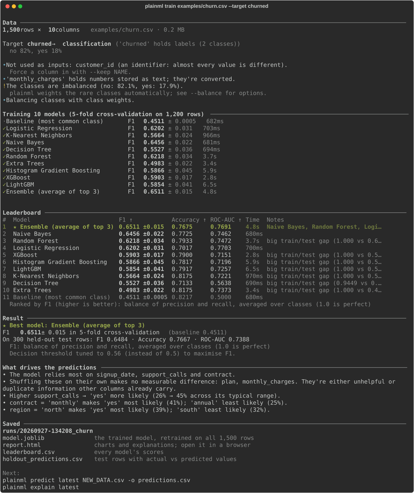
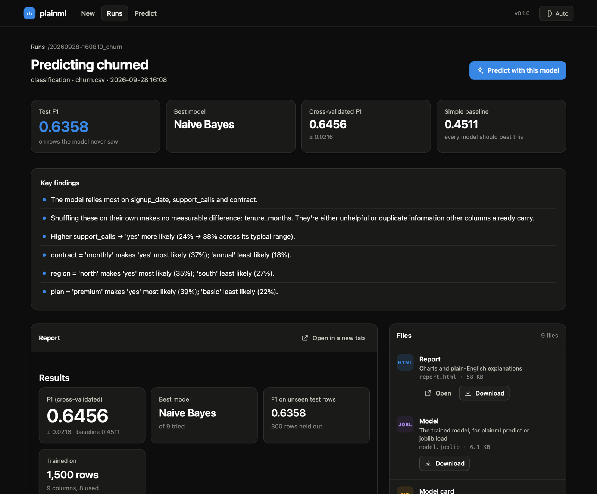
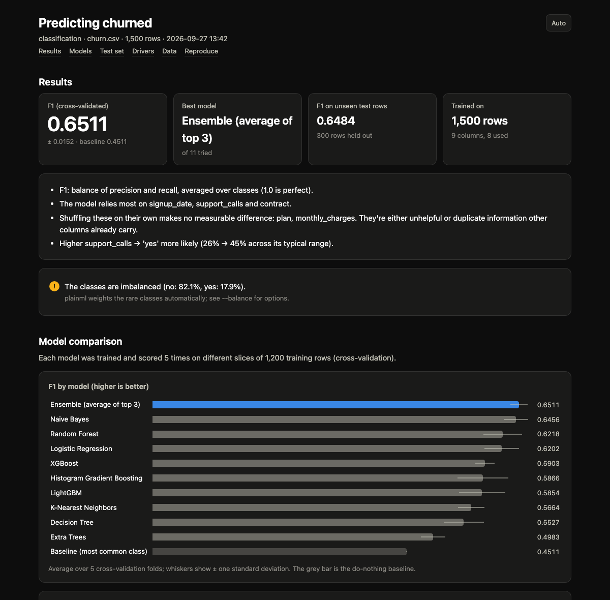

<h1 align="center">plainml</h1>

<p align="center">
  <b>Machine learning in plain English.</b><br>
  From a spreadsheet to a trained, explained, deployable model in one command, or one click.
</p>

<p align="center">
  <a href="https://pypi.org/project/plainml/"></a>
  <a href="https://pypi.org/project/plainml/"></a>
  <a href="https://github.com/pranay-obla/plainml/actions/workflows/ci.yml"></a>
  <a href="LICENSE"></a>
</p>

<p align="center"></p>

Point plainml at a CSV (or Excel, Parquet, JSON, a URL or a database) and name the column you want to
predict. It works out whether that's classification or regression, checks the data for problems, fairly
compares up to 17 models (30 with `--thorough`, including an optional PyTorch network), explains the
winner in plain English, and saves it with an HTML report and a model card. The model is then ready to
make predictions, serve as an API, ship in a Docker image or export.

It also forecasts, finds groups and unusual rows, ranks columns with 19 importance methods, and watches
for drift. Prefer clicking? `plainml web` opens a local website: drag in a file, choose what to find out,
and download whichever results you need.

## Contents

[Why plainml](#why-plainml) · [Install](#install) · [Quickstart](#30-second-quickstart) ·
[The website](#the-website) · [What it can do](#what-it-can-do) · [Models](#models) ·
[Reports and model cards](#reports-and-model-cards) · [Commands](#commands) · [Examples](#examples) ·
[Deploying](#deploying) · [Trust and privacy](#trust-and-privacy) · [Python API](#python-api) ·
[How it works](#how-it-works) · [How plainml compares](#how-plainml-compares) · [Development](#development)

## Why plainml

- **No code, no setup.** Blank cells, prices stored as text (`"$1,200"`), dates, free-text notes and ID
  columns are all handled automatically, and every saved model applies exactly the same preparation to
  new data.
- **Honest scores.** Models are ranked by cross-validation, the winner is checked on rows it never saw,
  and everything is compared against a do-nothing baseline. You get warnings for likely data leaks,
  imbalanced classes, overfitting, poorly calibrated probabilities, and data that simply can't predict
  the target.
- **Explained.** *"Higher support_calls → 'yes' more likely (24% → 38%)"*, which columns matter, and why
  any single prediction came out the way it did.
- **The whole workflow.** Profile → clean → train → tune → explain → predict → watch for drift → serve →
  deploy, plus forecasting, clustering, anomaly detection and feature importance.
- **For every level.** A website, a guided mode that asks questions, one-line commands, and a Python API.
- **Private by default.** Everything runs on your machine with no account, and `--private` keeps raw data
  values out of reports and saved files.

## Install

```bash
pip install plainml
```

Python 3.10 or newer. Optional extras add more:

| Extra | Adds |
|---|---|
| `boost` | XGBoost, LightGBM and CatBoost models |
| `tune` | Smarter hyperparameter search with Optuna |
| `explain` | SHAP explanations and SHAP importance |
| `imbalance` | SMOTE oversampling for rare classes |
| `web` | `plainml web`, the website |
| `serve` | `plainml serve`, a REST API (FastAPI) |
| `onnx` | `plainml export` to ONNX |
| `forecast` | Public holidays as forecasting features |
| `formats` / `fast` | Parquet and databases / faster loading of big files (polars) |
| `all` | Everything above |
| `torch` | A PyTorch neural network (not in `all`, since it's large) |
| `mlflow` | Logging runs to MLflow, and MLflow model export (not in `all`) |
| `cluster` | K-Medoids clustering (not in `all`: no prebuilt wheels for recent Pythons) |

```bash
pip install "plainml[all]"          # or pick: pip install "plainml[web,boost]"
```

## 30-second quickstart

The repository ships with example datasets in [`examples/`](examples):

```bash
plainml train examples/churn.csv --target churned
```

That prints a leaderboard and a plain-English summary, and saves a run folder such as
`runs/20260925-125240_churn/` with the model, `report.html`, `model_card.md` and more. Then predict on any
file with the same columns:

```bash
plainml predict latest examples/churn.csv -o predictions.csv
```

Not sure where to start? Run `plainml` on its own for **guided mode**, or `plainml web` for the website.

## The website

```bash
pip install "plainml[web]"
plainml web
```

1. **Upload.** Drag in a file and see every column's type and a preview of the rows.
2. **Pick a task.** Predict a column, forecast, find groups, find unusual rows, rank columns, check drift,
   profile or clean. The main options are up front; the rest are under *More options*.
3. **Watch it run.** A progress bar and a live log show each step.
4. **Get the results.** Headline numbers, the key findings in plain English, and the full report.
5. **Download what you need.** Every file the run produced is listed with its own **Download** button,
   and tables can be previewed first.

<p align="center"></p>

The **Runs** page lists everything you've run (from the website or the command line), and **Predict** uses
any saved model on a new upload. The site works in light and dark mode and on phones. It only listens on
your machine; to share it on a network, add a token: `plainml web --host 0.0.0.0 --token change-me`. More in
the [website guide](docs/website.md).

## What it can do

| Task | Command | What you get |
|---|---|---|
| **Predict a column** | `plainml train` | Classification (yes/no or several classes), regression, multi-label and multi-output. Models compared, the winner explained and saved |
| **Forecast** | `plainml forecast` | Backtested forecasts with an 80% range. One per store/product (`--group`), with planned inputs like promotions (`--inputs`) and public holidays (`--country`) |
| **Find groups** | `plainml cluster` | K-Means, agglomerative, Gaussian mixtures and HDBSCAN compared; each group described by what sets it apart |
| **Find unusual rows** | `plainml anomaly` | Isolation Forest, LOF, One-Class SVM and a robust distance combined into one score, with a reason for each flagged row |
| **Rank the columns** | `plainml importance` | Up to 19 importance methods, a consensus ranking, how many columns you actually need, and redundant groups |
| **Check for drift** | `plainml drift` | Which columns have shifted since training (PSI per column), weighted by how much the model relies on them |
| **Understand the data** | `plainml profile` / `clean` | Column types, gaps and warnings; a cleaned copy |
| **Improve a model** | `plainml tune` | Hyperparameter search (Optuna or random search) with a fair before/after comparison |
| **Use a model** | `plainml predict` / `explain` / `evaluate` | Predictions (also for files too big for memory), explanations of single rows, scores on new labelled data |
| **Ship it** | `plainml serve` / `deploy` / `export` | A REST API, a Docker image, or ONNX / MLflow files |

## Models

`plainml models` lists every model, which tasks it handles, and whether it's installed.

| Tier | Classification | Regression |
|---|---|---|
| **Every run** | Logistic regression, ridge, KNN, naive Bayes, SVM, decision tree, random forest, extra trees, gradient boosting, histogram gradient boosting, MLP, LDA, XGBoost†, LightGBM†, CatBoost† | Linear, ridge, lasso, elastic net, KNN, SVM, decision tree, random forest, extra trees, gradient boosting, histogram gradient boosting, MLP, Bayesian ridge, Huber, XGBoost†, LightGBM†, CatBoost† |
| **With `--thorough`** | QDA, AdaBoost, bagging, SGD, linear SVM, Gaussian process, PyTorch network‡ | AdaBoost, bagging, SGD, linear SVM, Gaussian process, Theil-Sen, RANSAC, Poisson, Gamma, Tweedie, kernel ridge, PLS, PyTorch network‡ |
| **Ensembles** | The top 3 averaged (every run); stacked (with `--thorough`) | Same |

† with the `boost` extra. ‡ with the `torch` extra.

- Every model is compared with a do-nothing **baseline** (the most common class, or the average).
- `--quick` runs only the fast models; `--models rf,lightgbm` or `--exclude svm` choose exactly.
- Naming a `--thorough` model runs it without the others (`--models torch`).
- Models that can't suit the data are skipped with the reason shown. Poisson regression needs a target
  that's never negative, for example, and slow models are skipped on large data.

**The PyTorch network** (`pip install "plainml[torch]"`) is a multi-layer perceptron for tables:
- Blocks of Linear → BatchNorm → ReLU → Dropout, narrowing layer by layer.
- Trained with AdamW (weight decay) on mini-batches, with early stopping on a validation split, keeping
  the best weights.
- Classification uses cross-entropy (class-weighted for rare classes). Regression uses Huber loss on
  standardised targets.
- It behaves like any scikit-learn model, so cross-validation, ensembles, tuning (width, depth, dropout,
  learning rate, weight decay), saving, `predict`, `serve` and `deploy` all work with it.
- It trains on the CPU by default. Set `PLAINML_TORCH_DEVICE=cuda` or `mps` for a GPU.

On spreadsheet-style data, gradient boosting usually wins; the network earns its place mostly inside
ensembles.

## Reports and model cards

Every run writes a self-contained `report.html` that works offline, in light and dark mode and on a phone.
For a trained model, it has:
- the model comparison
- test-set results: confusion matrix, ROC and precision-recall curves, and a calibration curve, or
  predicted-vs-actual for numbers
- what drives the predictions
- the data checks
- how to reproduce the run

Forecasts, clusters, anomalies, importance and drift get reports of their own.

<p align="center"></p>

Each trained model also gets a `model_card.md`: a one-page summary of what it predicts, the data it
learned from, how well it does (per class, too), what drives it, its caveats, and how to use it. It's
meant to travel with the model.

## Commands

| | Command | What it does |
|---|---|---|
| **Start here** | `plainml train DATA -t COLUMN` | Train and compare models; save the best with a report |
| | `plainml profile DATA` | Column types, gaps and warnings, without training |
| | `plainml clean DATA -o clean.csv` | Fix blanks, text numbers, dates, duplicates, capitalisation… |
| **Use a model** | `plainml predict MODEL DATA` | Predictions on new rows (`MODEL` can be `latest`) |
| | `plainml evaluate MODEL DATA` | Score on new labelled data and compare with training time |
| | `plainml explain MODEL [DATA] [--row N]` | What the model relies on, in plain English |
| | `plainml drift MODEL DATA` | Has new data drifted from what the model learned on? |
| | `plainml report RUN` | Rebuild and open a run's HTML report |
| **Improve** | `plainml tune [RUN]` | Hyperparameter search on the best models |
| | `plainml importance DATA -t COLUMN` | Rank columns with up to 19 methods and a consensus |
| | `plainml select DATA -t COLUMN` | Keep only the columns that matter |
| **Other problems** | `plainml cluster DATA` | Find groups of similar rows, and describe them |
| | `plainml anomaly DATA` | Find unusual rows and say why they're unusual |
| | `plainml forecast DATA -t COLUMN` | Forecast a value over time, with a range |
| **Deploy and share** | `plainml web` | The website: upload, run anything, download results |
| | `plainml serve MODEL` | A REST API with docs at `/docs` |
| | `plainml deploy MODEL` | A ready-to-build Docker image for the API |
| | `plainml export MODEL` | ONNX (for C#, Java, JavaScript, C++…) or MLflow |
| **Housekeeping** | `plainml runs` / `compare` / `models` / `init` | List, compare and prune runs; list models; write a config |

Every command has examples in `plainml COMMAND --help`, and the [command reference](docs/commands.md) lists
every option.

## Examples

```bash
# Regression, ranked by mean absolute error, fast models only
plainml train examples/house_prices.csv -t price --metric mae --quick

# Choose the models, cap the time, ignore a column, use SMOTE for rare classes
plainml train examples/churn.csv -t churned --models rf,lightgbm,xgboost --time-budget 5m --drop region --balance smote

# Several yes/no targets at once (multi-label)
plainml train data.csv -t is_spam,is_urgent

# Every model, including the extras and a stacked ensemble, with honest probabilities
plainml train examples/churn.csv -t churned --thorough --calibrate

# Squeeze more accuracy out of the last run
plainml tune latest --trials 50

# Which columns matter? Random forest importance, RFE, Boruta, SHAP... and a consensus
plainml importance examples/churn.csv -t churned --methods all

# Why did row 3 get its prediction?
plainml explain latest new_customers.csv --row 3

# Customer segments, suspicious payments, next month's sales
plainml cluster examples/customers.csv --drop member_id
plainml anomaly examples/transactions.csv --label is_fraud
plainml forecast examples/daily_sales.csv -t units_sold --horizon 30

# One forecast per store, using planned promotions and public holidays
plainml forecast stores.csv -t sales --group store --inputs promo --future plans.csv --country US

# Has this month's data drifted from what the model learned on?
plainml drift latest this_month.csv

# Predict a file too big for memory, 200,000 rows at a time
plainml predict latest huge.csv -o predictions.csv --chunk-size 200000

# Tidy up: keep only the 10 newest runs
plainml runs --prune --keep 10
```

A walkthrough of every example dataset is in [examples/README.md](examples/README.md).

## Deploying

**A REST API.** `plainml serve MODEL` starts a FastAPI server:

| Endpoint | |
|---|---|
| `POST /predict` | Send rows as JSON (`{"rows": [{...}, ...]}`), get predictions and probabilities back |
| `POST /forecast` | For forecast models: `{"horizon": 30}`, optionally `"groups": [...]` |
| `GET /` | What the model is, the columns it expects, and an example request |
| `GET /health` | A health check |
| `GET /docs` | Interactive documentation where you can try requests |

Add `--api-key SECRET` (or set `PLAINML_API_KEY`) and every request except `/health` and `/docs` needs the
header `X-API-Key: SECRET`.

**A Docker image.** `plainml deploy MODEL` writes a folder you can build and run anywhere containers run
(Cloud Run, App Runner, Azure Container Apps, Fly.io, Kubernetes…):

```bash
plainml deploy latest -o deploy/churn
docker build -t churn deploy/churn
docker run -p 8000:8000 -e PLAINML_API_KEY=change-me churn
```

The folder holds:
- the model and its model card
- a slim Dockerfile that runs as a non-root user, with a health check
- `requirements.txt`, pinned to the exact library versions the model was trained with (only the ones it
  needs)
- a README with the commands to build, run and call it

If you installed plainml from a checkout rather than PyPI, the folder also bundles a plainml wheel, so the
build doesn't need PyPI.

**Files.** `plainml export MODEL` writes ONNX (checked against the original model), for C#, Java,
JavaScript or C++. `--format mlflow` saves an MLflow model, and `plainml train --mlflow` logs runs to your
MLflow tracking server.

## Trust and privacy

- **Calibration.** The report shows whether "70% sure" really means right 70% of the time (a reliability
  curve, the Brier score and the average gap). `--calibrate` fixes probabilities that are off.
- **Drift.** A saved model remembers what its training data looked like. `plainml predict` warns when new
  rows look clearly different, and `plainml drift` shows which columns moved and how much that matters.
- **Private runs.** With `--private` (on `train`, `cluster`, `anomaly` and `importance`), the report, run
  folder and model keep only file names, column names and summary numbers: no example rows, raw values
  or data paths.
- **Safe loading.** Saved models record their library versions, and plainml explains how to fix a
  mismatch. Only load model files you trust: loading a joblib/pickle file can run code.

## Python API

Everything the command line does is available from Python and notebooks:

```python
import plainml

result = plainml.train("examples/churn.csv", target="churned", quick=True)
print(result.best_model, result.cv_score)
result.leaderboard  # a DataFrame (renders as a table in Jupyter)

predictions = plainml.predict(result.run_dir, "new_customers.csv", proba=True)
why = plainml.explain(result.run_dir)
print(why.sentences)

groups = plainml.cluster("examples/customers.csv", drop=["member_id"])
forecast = plainml.forecast("examples/daily_sales.csv", "units_sold", horizon=30)
ranked = plainml.feature_importance("examples/churn.csv", "churned", methods=["rf", "rfe", "boruta"])
drift = plainml.check_drift(result.run_dir, "this_month.csv")
```

Saved models are ordinary scikit-learn objects that accept raw rows (strings, blanks and all):

```python
import joblib, pandas as pd

model = joblib.load("runs/20260925-125240_churn/model.joblib")
model.predict(pd.read_csv("new_customers.csv"))
```

See the [Python API guide](docs/python-api.md).

## Reproducible runs

Each run saves its settings, library versions and a fingerprint of the data. Rerun it exactly with:

```bash
plainml train --config runs/20260925-125240_churn/config.yaml
```

or start your own commented config with `plainml init`.

## How it works

1. **Profile.** Each column is classified as number, category, date, free text, ID or constant. IDs and
   constants are set aside, and you get warnings about leaks, imbalance, heavy blanks and tiny datasets.
2. **Split.** 20% of rows are held out as a final test set that no model sees while models are chosen.
3. **Compare.** Every model runs inside the same pipeline:
   - fill blanks, and flag which cells were blank
   - scale numbers
   - one-hot encode categories
   - TF-IDF word features for text
   - date parts

   Each is scored with 5-fold cross-validation next to the baseline. Rare classes get weights (or SMOTE),
   and imbalanced yes/no problems also get a tuned decision threshold.
4. **Check and explain.** The winner is scored on the held-out rows, checked for calibration and
   overfitting, and explained with permutation importance and effect curves.
5. **Save.** The winner is retrained on all rows and saved with:
   - its preprocessing
   - the report and model card
   - a summary of the training data, for drift checks

More detail, including forecasting, importance and drift, is in [docs/how-it-works.md](docs/how-it-works.md).

## How plainml compares

plainml isn't the only way to get a model without writing much code. It's built for people who want to
**understand** a result and trust it, not squeeze out the last 0.5% of accuracy. It's free, runs on your
machine, needs no account, and says what it found in plain English.

| | Use it from | Runs where | Main strength | Where plainml differs |
|---|---|---|---|---|
| **plainml** | Command line, guided mode, website, Python | Your machine | Explained, honest results for the whole workflow | |
| [PyCaret](https://github.com/pycaret/pycaret) | Python / notebooks | Your machine | Low-code workflow with many models and tasks | plainml adds a CLI, a website and plain-English findings, and needs no code |
| [AutoGluon](https://auto.gluon.ai/) | Python | Your machine | Top accuracy through heavy stacking | plainml is lighter and faster, and explains more; AutoGluon usually scores higher |
| [MLJAR AutoML](https://github.com/mljar/mljar-supervised) | Python | Your machine | Markdown reports for every model | plainml also covers forecasting, drift, clustering and deployment, with a website |
| [H2O AutoML](https://h2o.ai/platform/h2o-automl/) | Python, R, web UI (Flow) | Your machine or a cluster | Scales to very large data | plainml is a single pip install with no Java, aimed at newcomers |
| [Orange](https://orangedatamining.com/), [KNIME](https://www.knime.com/) | Desktop app | Your machine | Visual drag-and-drop workflows | plainml chooses the steps for you instead of you wiring them together |
| DataRobot, Dataiku, cloud AutoML (Vertex AI, SageMaker Canvas, Azure) | Web platform | Their servers or your company's | Enterprise features: governance, monitoring, teams | plainml is free and local; your data doesn't leave your machine |

Single-purpose tools also do parts of this well: [ydata-profiling](https://github.com/ydataai/ydata-profiling)
for profiling, [Evidently](https://www.evidentlyai.com/) for drift, [Prophet](https://facebook.github.io/prophet/)
and [StatsForecast](https://github.com/Nixtla/statsforecast) for forecasting, and
[mlxtend](https://rasbt.github.io/mlxtend/) and [BorutaPy](https://github.com/scikit-learn-contrib/boruta_py)
for feature selection.

**When to reach for something else:** AutoGluon when accuracy is all that matters; H2O for data that doesn't
fit on one machine; PyCaret if you live in notebooks and want to customise every step; an enterprise platform
when a team needs approvals, monitoring and access control.

## Development

```bash
git clone https://github.com/pranay-obla/plainml && cd plainml
pip install -e ".[all,dev]"
pre-commit install
pytest
```

<details>
<summary>Where things live</summary>

| Path | What's there |
|---|---|
| `plainml/cli.py`, `wizard.py` | The command line and guided mode |
| `plainml/training.py`, `registry.py`, `deep.py` | Training, the model table, the PyTorch network |
| `plainml/preprocessing.py`, `schema.py`, `tasks.py`, `metrics.py` | Column types, preparation, task detection, metrics |
| `plainml/profiling.py`, `cleaning.py`, `io.py` | Data checks, cleaning, reading and writing files |
| `plainml/evaluation.py`, `explaining.py`, `tuning.py` | Test-set scoring and calibration, explanations, tuning |
| `plainml/forecasting.py`, `clustering.py`, `anomaly.py` | The other kinds of problem |
| `plainml/importance.py`, `drift.py` | Feature importance and drift |
| `plainml/predicting.py`, `serve.py`, `deploy.py`, `export.py`, `tracking.py` | Predicting, the API, Docker, ONNX, MLflow |
| `plainml/report.py`, `card.py`, `runs.py` | HTML reports, model cards, run folders |
| `plainml/web/` | The website: API server, job runner, and the page itself (`static/`) |
| `tests/`, `docs/`, `examples/` | Tests, the documentation site, example datasets |

</details>

CI runs the tests on Python 3.10 to 3.14 (Linux, macOS, Windows), with every optional extra (PyTorch
included), against the oldest supported library versions, and weekly against the newest releases, so a
library update can't silently break plainml. The docs site is published to GitHub Pages from `docs/`.

## Author

[@pranay-obla](https://github.com/pranay-obla)

plainml grew out of [curdrice](https://github.com/pranay-obla/curdrice-v2), a hackathon project by
[@hrishitb](https://www.github.com/Hrishit-B), [@pranayobla](https://www.github.com/pranay-obla),
[@shriharik](https://www.github.com/RiriSensei) and [@ankitthomas](https://www.github.com/AlmondBox-3996).

## Acknowledgements

Built on [scikit-learn](https://scikit-learn.org/), [pandas](https://pandas.pydata.org/),
[NumPy](https://numpy.org/), [Rich](https://github.com/Textualize/rich), [Click](https://click.palletsprojects.com/),
[questionary](https://github.com/tmbo/questionary) and [joblib](https://joblib.readthedocs.io/), with optional
[XGBoost](https://xgboost.ai/), [LightGBM](https://lightgbm.readthedocs.io/), [CatBoost](https://catboost.ai/),
[PyTorch](https://pytorch.org/), [Optuna](https://optuna.org/), [SHAP](https://shap.readthedocs.io/),
[imbalanced-learn](https://imbalanced-learn.org/), [FastAPI](https://fastapi.tiangolo.com/),
[skl2onnx](https://onnx.ai/sklearn-onnx/), [holidays](https://github.com/vacanza/holidays) and
[MLflow](https://mlflow.org/).

[MIT licensed](LICENSE).
